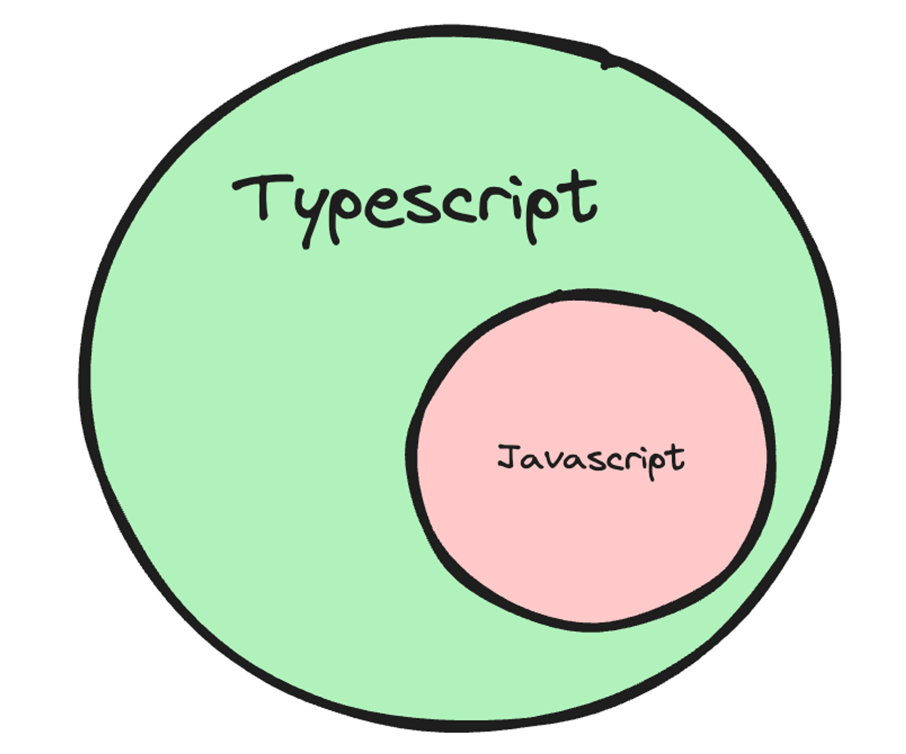
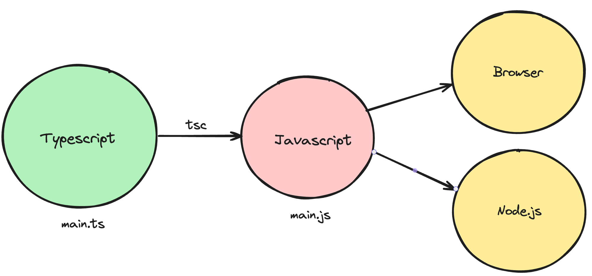
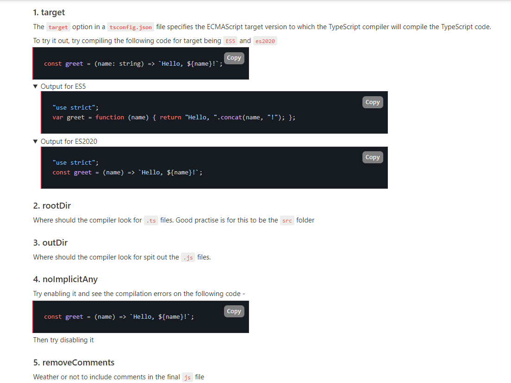

## Types of languages
* There are two types of laguages:
1. Strongly typed Language 
2. loosely typed language

## Strongly typed vs loosely typed
* The terms strongly typed and loosely typed refer to how programming languages handle types, particularly how strict they are about type conversions and type safety.
### Strongly typed languages
- Examples - Java, C++, C, Rust
- Benefits - Lesser runtime errors, Stricter codebase, Easy to catch errors at compile time
### Loosely typed languages
- Examples - Python, Javascript, Perl, php
- Benefits - Easy to write code, Fast to bootstrap, Low learning curve

* Note- People realised that javascript is a very power language, but lacks types.


# What is typescript ?
* TypeScript is a programming language developed and maintained by Microsoft. 
* It is a strict syntactical superset of JavaScript and adds optional static typing to the language.



## Where/How does typescript code run ?
* Typescript code never runs in your browser. Your browser can only understand javascript. 
1. Javascript is the runtime language (the thing that actually runs in your browser/nodejs runtime)
2. Typescript is something that compiles down to javascript
3. When typescript is compiled down to javascript, you get type checking (similar to C++). If there is an error, the conversion to Javascript fails. 




### Typescript compiler
* tsc is the official typescript compiler that you can use to convert Typescript code into Javascript
* There are many other famous compilers/transpilers for converting Typescript to Javascript. Some famous ones are - 
1. esbuild
2. swc

## How to install Typescript Node.js application locally on our machines ?
1. npm install -g typescript
2. npm init -y &  npx tsc --init 

. This is the high level benefit of typescript. It lets you catch type errors at compile time

# Basic Types in TypeScript
* Typescript provides you some basic types number, string, boolean, null, undefined, any.

## The tsconfig file


# Interfaces
##  What are interfaces ?
* How can you assign types to objects? For example, a user object that looks like this - 
```.js
const user = {
	firstName: "harkirat",
	lastName: "singh",
	email: "email@gmail.com".
	age: 21,
}
```
To assign a type to the user object, you can use interfaces
```.ts
interface User {
	firstName: string;
	lastName: string;
	email: string;
	age: number;
}
```
#### Task - Create a React component that takes todos as an input and renders them
```.js
// Todo.tsx
interface TodoType {
    title: string;
    description: string;
    done: boolean;
  }
  
  interface TodoInput {
    todo: TodoType;
  }
  
  function Todo({ todo }: TodoInput) {
    return <div>
      <h1>{todo.title}</h1>
      <h2>{todo.description}</h2>
      
    </div>
  }
```

# Types
## What are types ?
* Very similar to interfaces , types let you aggregate data together.
```.ts
type User = {
	firstName: string;
	lastName: string;
	age: number
}

```

# Arrays in TS
* If you want to access arrays in typescript, it’s as simple as adding a [] annotation next to the type

# ENUMS in TS
* Enums (short for enumerations) in TypeScript are a feature that allows you to define a set of named constants.
* The concept behind an enumeration is to create a human-readable way to represent a set of constant values, which might otherwise be represented as numbers or strings.

# TypeScript Tuples
* A tuple is a typed array with a pre-defined length and types for each index.
* Tuples are great because they allow each element in the array to be a known type of value.
* A good practice is to make your tuple readonly.
```.ts
// define our tuple
let ourTuple: [number, boolean, string];
// initialize correctly
ourTuple = [5, false, 'Coding God was here'];
ourTuple.push('Something new and wrong');
console.log(ourTuple);
```
* Named tuples allow us to provide context for our values at each index.
```.ts
const graph: [x: number, y: number] = [55.2, 41.3];
```

* Since tuples are arrays we can also destructure them.
```.ts
// Define a tuple
let tuple: [number, string, boolean] = [10, "hello", true];
// Destructuring the tuple
let [num, str, bool] = tuple;

// Now you can use the individual values
console.log(num); // Output: 10
console.log(str); // Output: hello
console.log(bool); // Output: true

```

# TypeCasting in TS

* TypeScript provides type casting mechanisms to explicitly convert a value from one type to another. This is particularly useful when TypeScript's type inference doesn't automatically determine the desired type, or when you're working with union types and need to narrow down the type.
* There are two main ways to perform type casting in TypeScript:

## 1. Angle Bracket Syntax:
```.ts
let someValue: any = "hello";
let strLength: number = (<string>someValue).length;
```
## 2. As-Keyword Syntax:
```.ts
let someValue: any = "hello";
let strLength: number = (someValue as string).length;
```

# TS API
## Pick
* Pick allows you to create a new type by selecting a set of properties (Keys) from an existing type (Type).
* Imagine you have a User model with several properties, but for a user profile display, you only need a subset of these properties.
```.ts
interface User {
  id: number;
  name: string;
  email: string;
  createdAt: Date;
}

// For a profile display, only pick `name` and `email`
type UserProfile = Pick<User, 'name' | 'email'>;

const displayUserProfile = (user: UserProfile) => {
  console.log(`Name: ${user.name}, Email: ${user.email}`);
};
```

## Partial
* Partial makes all properties of a type optional, creating a type with the same properties, but each marked as optional.
* Specifically useful when you want to do updates
```.ts
interface User {
    id: string;
    name: string;
    age: string;
    email: string;
    password: string;
};

type UpdateProps = Pick<User, 'name' | 'age' | 'email'>

type UpdatePropsOptional = Partial<UpdateProps>

function updateUser(updatedProps: UpdatePropsOptional) {
    // hit the database tp update the user
}
updateUser({})
```

## Readonly
* When you have a configuration object that should not be altered after initialization, making it Readonly ensures its properties cannot be changed.
```.ts
interface Config {
  readonly endpoint: string;
  readonly apiKey: string;
}

const config: Readonly<Config> = {
  endpoint: 'https://api.example.com',
  apiKey: 'abcdef123456',
};

// config.apiKey = 'newkey'; // Error: Cannot assign to 'apiKey' because it is a read-only property.
```

## Record
* Record let’s you give a cleaner type to objects.
You can type objects like follows - 
```.ts
interface User {
  id: string;
  name: string;
}

type Users = { [key: string]: User };

const users: Users = {
  'abc123': { id: 'abc123', name: 'John Doe' },
  'xyz789': { id: 'xyz789', name: 'Jane Doe' },
};
```
or use Record -
```.ts
interface User {
  id: string;
  name: string;
}

type Users = Record<string, User>;

const users: Users = {
  'abc123': { id: 'abc123', name: 'John Doe' },
  'xyz789': { id: 'xyz789', name: 'Jane Doe' },
};

console.log(users['abc123']); // Output: { id: 'abc123', name: 'John Doe' }
```

## Map
* Maps gives you an even fancier way to deal with objects. Very similar to Maps in C++
```.ts
interface User {
  id: string;
  name: string;
}

// Initialize an empty Map
const usersMap = new Map<string, User>();

// Add users to the map using .set
usersMap.set('abc123', { id: 'abc123', name: 'John Doe' });
usersMap.set('xyz789', { id: 'xyz789', name: 'Jane Doe' });

// Accessing a value using .get
console.log(usersMap.get('abc123')); // Output: { id: 'abc123', name: 'John Doe' }
```

## Exclude
* In a function that can accept several types of inputs but you want to exclude specific types from being passed to it.
```.ts
type Event = 'click' | 'scroll' | 'mousemove';
type ExcludeEvent = Exclude<Event, 'scroll'>; // 'click' | 'mousemove'

const handleEvent = (event: ExcludeEvent) => {
  console.log(`Handling event: ${event}`);
};

handleEvent('click'); // OK
```

# Type inference in zod
* When using zod, we’re done runtime validation. 
* For example, the following code makes sure that the user is sending the right inputs to update their profile information
```.ts
import { z } from 'zod';
import express from "express";

const app = express();

// Define the schema for profile update
const userProfileSchema = z.object({
  name: z.string().min(1, { message: "Name cannot be empty" }),
  email: z.string().email({ message: "Invalid email format" }),
  age: z.number().min(18, { message: "You must be at least 18 years old" }).optional(),
});

app.put("/user", (req, res) => {
  const { success } = userProfileSchema.safeParse(req.body);
  const updateBody = req.body; // how to assign a type to updateBody?

  if (!success) {
    res.status(411).json({});
    return
  }
  // update database here
  res.json({
    message: "User updated"
  })
});

app.listen(3000);
```